# PyMOL Shortcuts Manager Plugin, Version 0.4.1


A PyQt-based plugin for managing, searching, and executing [PyMOL shortcuts](https://github.com/MooersLab/pymolshortcuts) directly inside the PyMOL molecular-graphics application, but for now, use the `pymolshortcuts.py` included here.
The plugin integrates an AI assistant powered by a lightweight Retrieval-Augmented Generation (RAG) engine to answer questions about the shortcuts in natural language.


## Table of Contents

- [Upcoming presentations](#Upcoming-live-presentations)
- [Features](#features)
- [Plugin Components](#plugin-components)
- [Requirements](#requirements)
- [Installation](#installation)
- [Quick Start](#quick-start)
- [Plugin Tabs](#plugin-tabs)
- [Tags](#tags)
- [Tutorials](#tutorials)
- [AI Assistant](#ai-assistant)
- [Agentic AI](#agentic-ai)
- [MCP server](#mcp-server)
- [Testing](#testing)
- [Project Layout](#project-layout)
- [Citation](#citation)
- [Contributing](#contributing)
- [Licenses](#licenses)
- [Funding](#sources-of-funding)

## Upcoming live presentations

I will be presenting a 45-minute tutorial on this software at the Software Fayre, which runs in parallel with the triennial Congress of the International Union of Crystallography, at 11:15 AM on August 13, 2026, in Room 220 of the congress center in Calgary, Alberta.
See the [meeting website](http://www.cryst.chem.uu.nl/lutz/thursday.html).

## Features

- Searchable shortcut table with click-to-execute functionality and sortable columns.
- AI Assistant with RAG-based retrieval over the shortcuts file, supporting five LLM providers (Claude, OpenAI, Ollama, Gemini, and custom OpenAI-compatible endpoints).
- RAG timing statistics are displayed during indexing so users can profile embedding and chunking performance.
- Tutorial tab with seven step-by-step walkthroughs that run shortcut commands directly in PyMOL.
- Citation tab with ready-to-copy BibTeX and EndNote entries.
- History and Favorites tabs with persistent storage across sessions.
- Add Shortcut tab for authoring new shortcuts and submitting them as pull requests to GitHub
- Settings tab backed by QSettings for cross-session preference persistence
- Bundled shortcuts load automatically on first launch, so a new user does not need to visit the Installation tab. The plugin uses the copy that ships with it, downloading and caching it once to `~/.pymolshortcuts/pymolshortcuts.py` when the plugin was installed as a single file. A single `use_bundled_default` setting turns this off.
- Automatic shortcuts discovery on plugin startup: checks the module-level auto-load path, then QSettings, then the bundled copy, then well-known filesystem locations (`~/.pymol/startup`, PyMOL startup directories).
- The Installation tab persists the shortcuts file path to QSettings on every successful install, so the Shortcuts tab is pre-populated on subsequent plugin opens without requiring reinstallation.
- Agentic AI tab that wires a coding harness (Claude Code, Pi, or any CLI agent) to the shortcut library, so a new shortcut can be generated, validated, and documented without leaving PyMOL.
- Three-tier validation of generated shortcuts: a static check against the docstring contract, the generated pytest module, and an optional run inside the live PyMOL session behind a confirmation dialog.
- Skill discovery across the bundled `skills/` directory, the working directory, and `~/.claude/skills`, with two first-party skills shipped in the repository.
- A companion MCP server that exposes the shortcut library, the validator, the test runner, and the live session as Model Context Protocol tools, so an external harness can drive the plugin.
- Cross-platform support for macOS, Linux, and Windows, with automated psico dependency installation.
- Command-line launchers `scg` and `psm` in `pymolshortcuts.py` reopen the Shortcuts Manager GUI from the PyMOL prompt, so you do not need to return to the Plugin menu.


## Plugin Components

### Installation tab

The installation menu for installing pymolshortcuts.py, the psico module, and pyqtdarktheme.
The theme can be changed in the Settings menu.
The font size can also be increased to 24 points.

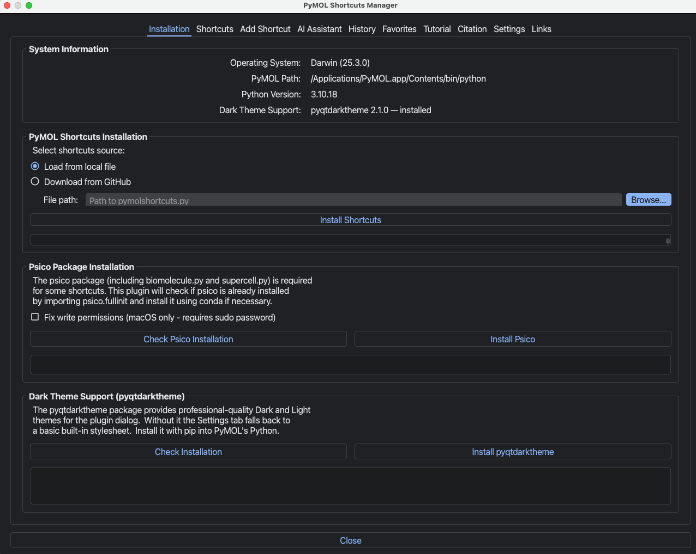

### Shortcuts tab

This will be blank on first startup. It will show shortcuts on the second startup after installation.

Every shortcut carries a set of tags. The table shows a Tags column, the details panel lists the tags for the selected shortcut, and the Tag selector beside the search box filters the table to one tag at a time. You can edit the tags for the selected shortcut in the Tags field and click Save Tags. Tags follow the hybrid model described under [Tags](#tags): canonical tags live in the `TAGS:` section of each docstring in `pymolshortcuts.py`, and a per-user overlay in `~/.pymolshortcuts/tags.json` records local changes.

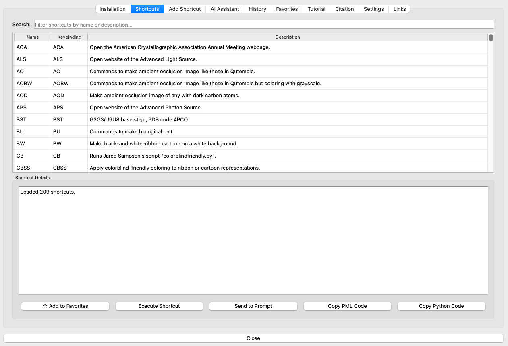

### Add Shortcut tab

Interface for building your own shortcuts and sharing them by pushing to GitHub.

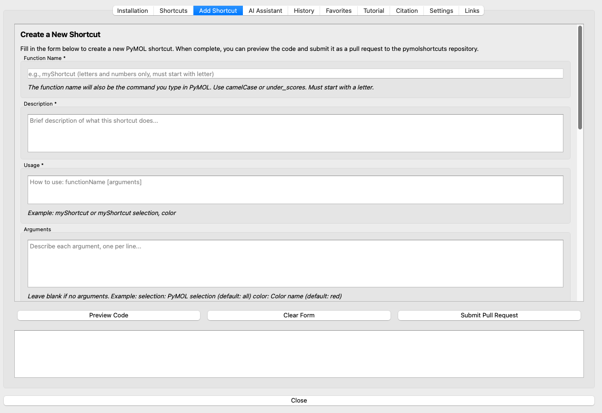

### AI assistant tab

Embed the current shortcuts and query your favorite LLM about them.

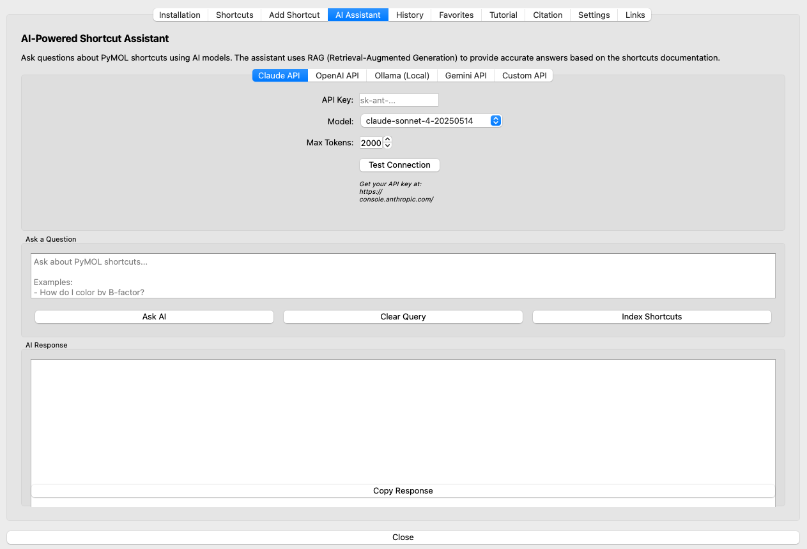

### Agentic AI tab

Wire a coding harness to the plugin and build new shortcuts with it. The AI
Assistant tab answers questions about shortcuts that already exist; this tab writes shortcuts that do not exist yet. Four panes cover the workflow: Harness
configures and tests the agent, Workbench runs the generate, test, and document
loop, Skills selects which SKILL.md files a run may use, and Runs keeps the record of past runs.

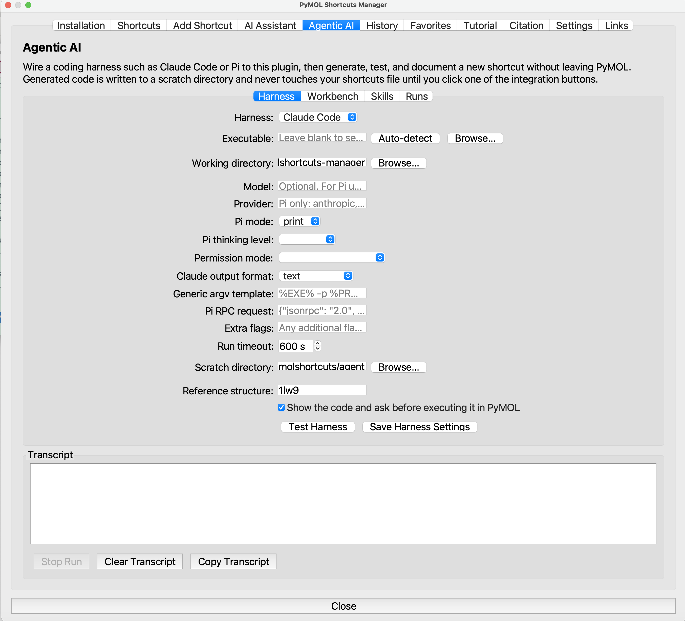

### History tab

Track your work.

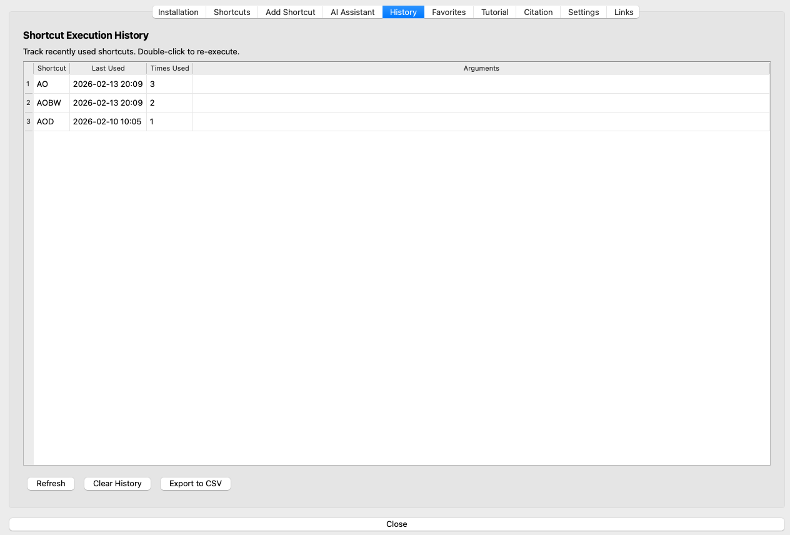

### Installation tab

Store frequently used shortcuts for fast access.

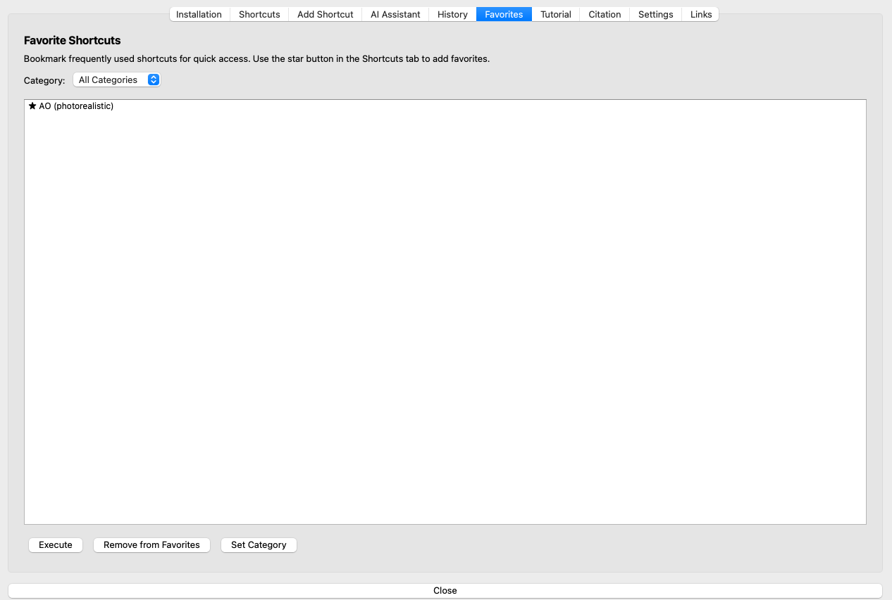

### Tutorials tab

Some examples to get you started.

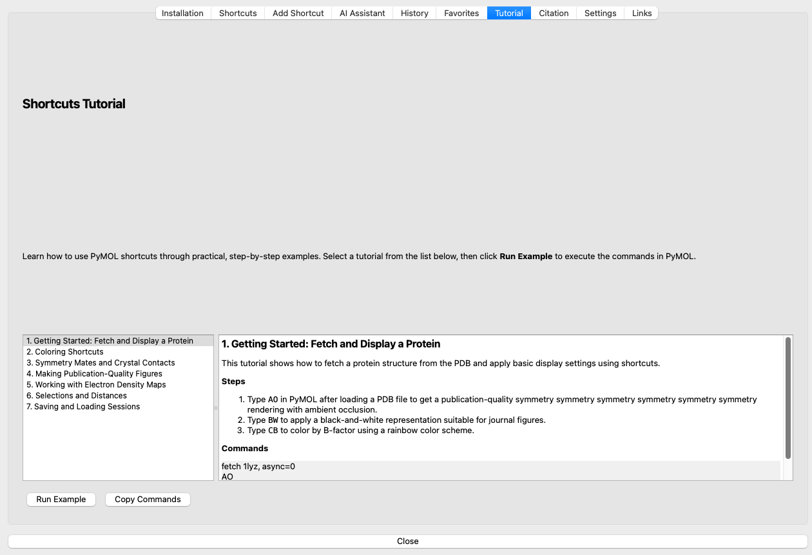

### Citation tab

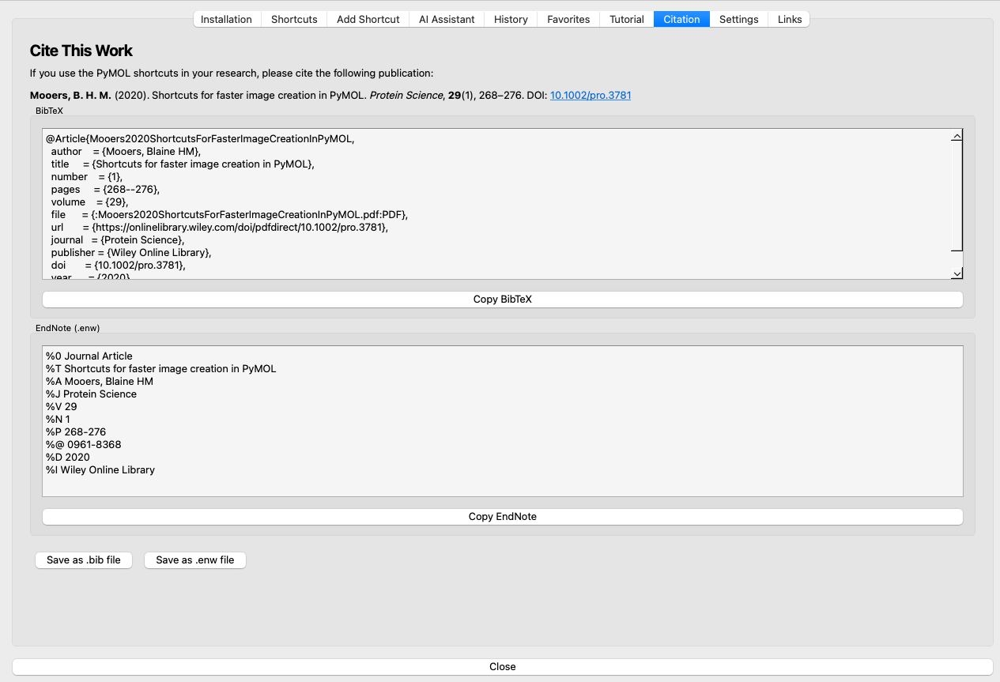

Painlessly copy citation information.

### Installation tab
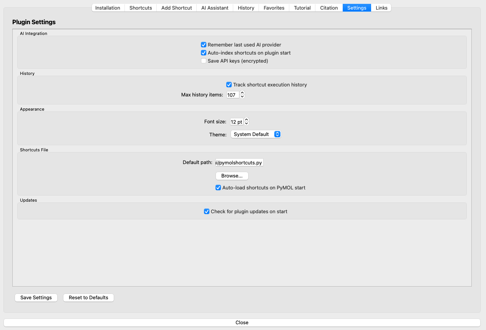

Settings include setting the path to the pymolshortcuts.py file when it is not in the standard location.

### Links tab

Links to related information.

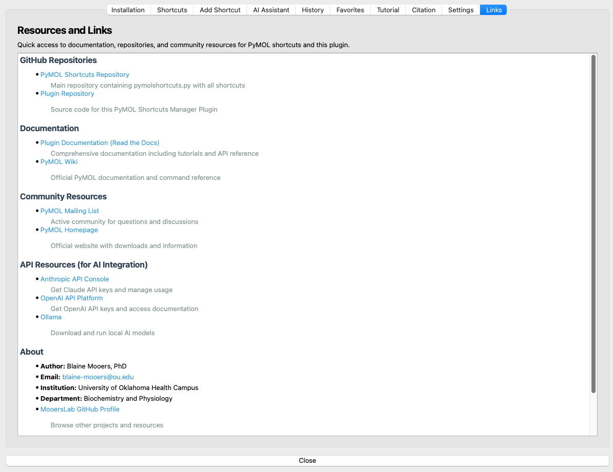


## Requirements

| Dependency       | Version       | Notes                                                                       |
|:-----------------|:--------------|:----------------------------------------------------------------------------|
| Python           | 3.8 or later  | Ships with PyMOL 3.x                                                        |
| PyMOL            | 3.x           | Open-source or incentive; provides the `pymol.Qt` abstraction               |
| pymolshortcuts.py| latest        | Downloaded from [MooersLab/pymolshortcuts](https://github.com/MooersLab/pymolshortcuts) or loaded from a local copy |

**Optional** (for the AI Assistant tab):

| Provider         | What you need                                                               |
|:-----------------|:----------------------------------------------------------------------------|
| Anthropic Claude | API key from [console.anthropic.com](https://console.anthropic.com/)        |
| OpenAI           | API key from [platform.openai.com](https://platform.openai.com/)            |
| Google Gemini    | API key from [aistudio.google.com](https://aistudio.google.com/)            |
| Ollama (local)   | [Ollama](https://ollama.com/) running on `localhost:11434`                  |
| Custom API       | Any OpenAI-compatible endpoint (e.g., LM Studio, vLLM, Together AI)         |


## Installation

### Method 1: PyMOL Plugin Manager (recommended)

1. Open PyMOL.
2. Navigate to **Plugin → Plugin Manager → Install New Plugin**.
3. Choose **Install from local file** and select `pymolshortcuts_manager.py`.
4. Restart PyMOL.  The plugin appears under **Plugin → PyMOL Shortcuts Manager**.

### Method 2: Manual installation

Copy the plugin file into the PyMOL startup directory:

```bash
# macOS
cp pymolshortcuts_manager.py ~/.pymol/startup/

# Linux
cp pymolshortcuts_manager.py ~/.pymol/startup/

# Windows (PowerShell)
Copy-Item pymolshortcuts_manager.py "$env:APPDATA\PyMOL\startup\"
```

### Method 3: `.pymolrc` auto-run

Add the following line to your `~/.pymolrc` file (create it if it does not exist):

```python
run ~/path/to/pymolshortcuts_manager.py
```

### Persisting the shortcuts file between sessions

The plugin now **automatically persists** the shortcuts file path every
time you install shortcuts through the Installation tab.  On subsequent
plugin opens the Shortcuts tab is pre-populated immediately — no
reinstallation required.

The resolution order when the plugin opens is:

1. **Module-level auto-load path** — set by `__init_manager__` when
   *auto-load* is enabled in the Settings tab.
2. **QSettings saved path** — written automatically whenever you install
   shortcuts via the Installation tab.
3. **Well-known filesystem locations** — `~/pymolshortcuts.py`,
   `~/Library/PyMOL/startup/pymolshortcuts.py` (macOS),
   `~/.pymol/startup/pymolshortcuts.py` (Linux), and
   `%APPDATA%\PyMOL\startup\pymolshortcuts.py` (Windows).

You can also configure the default path and enable auto-load explicitly
in the **Settings** tab.


## Quick Start

1. Launch PyMOL.
2. Open the plugin: **Plugin → PyMOL Shortcuts Manager**.
3. Go to the **Installation** tab and either browse to a local copy of
   `pymolshortcuts.py` or download it from GitHub.
4. Click **Install Shortcuts**.
5. Switch to the **Shortcuts** tab, type a keyword in the search box,
   and double-click a shortcut to execute it.

### Reopening the GUI from the PyMOL command line

After the shortcuts file is loaded, you can reopen the Shortcuts Manager
GUI at any time by typing `scg` or `psm` at the PyMOL prompt. Both call the
plugin's `run_plugin_gui()` launcher, so a trip to the Plugin menu is not
needed. `scg` stands for shortcut-manager GUI, and `psm` stands for
pymolshortcuts-manager. Each locates the loaded manager module before
falling back to the common import paths, so it prints a short install hint
when the plugin is not yet available.


## Plugin Tabs

The plugin dialog contains eleven tabs organized by workflow:

| Tab          | Purpose                                                                                              |
|:-------------|:-----------------------------------------------------------------------------------------------------|
| Shortcuts    | Searchable, sortable table of all shortcuts; filter by tag; view and edit tags; click to execute; view docstrings; copy PML or Python |
| Add Shortcut | Author a new shortcut with structured docstring fields; preview generated code; submit a GitHub PR    |
| AI Assistant | Ask natural-language questions about shortcuts; uses RAG retrieval with five LLM back-ends            |
| Agentic AI   | Drive a coding harness to generate, validate, and document a new shortcut; manage skills and run history |
| History      | View, re-execute, and export a timestamped log of every shortcut you have run                         |
| Favorites    | Star frequently used shortcuts for quick access; organize by category                                 |
| Tutorial     | Seven guided walkthroughs that teach shortcut usage by running commands inside PyMOL                   |
| Citation     | Copy or save BibTeX and EndNote entries for the Mooers 2020 *Protein Science* paper                   |
| Settings     | Configure default file paths, auto-load behavior, AI provider preferences, and display options         |
| Links        | Curated hyperlinks to documentation, the GitHub repository, and related resources                      |
| Installation | Optional maintenance panel at the right end: update the cached shortcuts, install `psico`, detect OS  |

## Tags

Each shortcut carries a set of tags that group it with related shortcuts, so you can pull up every rendering shortcut or every web-search shortcut at once rather than scrolling the whole table.

Tags use a hybrid storage model. The canonical tags live in a `TAGS:` section in each shortcut docstring in `pymolshortcuts.py`, placed immediately after the `DESCRIPTION:` section, so the tags travel with the library and reach the MCP server and the retrieval engine. A per-user overlay in `~/.pymolshortcuts/tags.json` records local additions and removals layered on top of the docstring tags, so you can retag without rewriting the shared file. The effective tag set for a shortcut is the docstring tags, plus the overlay additions, minus the overlay removals.

Tags come from a controlled vocabulary seeded from the comment banners in the library, such as `web-search`, `molecular-graphics`, `rendering`, `coloring`, and `electron-density`. The Tags field in the Shortcuts tab offers the vocabulary as autocomplete, and strict mode, on by default, warns when you save a tag that is not in the vocabulary. The Settings tab chooses whether Save Tags writes to the shortcuts file or to the overlay. When it writes to the file, a timestamped backup is written first and a confirmation dialog names the backup path.

The `TAGS:` section is a comma-separated line of lowercase tokens, with a hyphen for multi-word tags:

```
DESCRIPTION:
Commands to make an ambient occlusion image like those in QuteMol.

TAGS:
ambient-occlusion, rendering, coloring

USAGE:
AO
```

The bundled `tools/tag_shortcuts.py` generated the first draft of the tags across the library from the comment banners and from keyword cues in each docstring. Re-run it with `--diff` to see proposed changes, or `--apply` to write them after a backup.


## Tutorials

The **Tutorial** tab provides seven self-contained lessons.
Each tutorial includes explanatory text, the shortcut commands involved, and a **Run Example** button that executes the commands directly in the PyMOL viewport.

| #  | Title                                        | Shortcuts covered                 |
|:---|:---------------------------------------------|:----------------------------------|
| 1  | Getting Started: Fetch and Display a Protein | `fetch`, `AO`                     |
| 2  | Coloring Shortcuts                           | `CB`, `CR`, color-by-chain        |
| 3  | Symmetry Mates and Crystal Contacts          | `SC`, supercell generation        |
| 4  | Making Publication-Quality Figures           | `BW`, `AO`, ray-tracing settings  |
| 5  | Working with Electron Density Maps           | `emaps`, mesh/surface display     |
| 6  | Selections and Distances                     | `SA`, distance measurements       |
| 7  | Saving and Loading Sessions                  | Session file I/O shortcuts        |


## AI Assistant

The AI Assistant tab implements a lightweight RAG pipeline so that answers are grounded in the actual content of `pymolshortcuts.py`.

### How RAG works in this plugin

1. **Load** — The shortcuts file is read into memory.
2. **Chunk** — The text is split into overlapping 500-token chunks (100-token overlap) to preserve context across boundaries.
3. **Embed** — Each chunk receives a simple term-frequency embedding vector (no external model required).
4. **Search** — At query time, the user's question is embedded and compared to every chunk via cosine similarity; the top-*k* chunks are retrieved.
5. **Generate** — The retrieved chunks are prepended to the prompt sent to the selected LLM, which generates a context-aware answer.

Timing statistics for each step (file loading, chunking, embedding) are printed to the status area during indexing.

The AI tab discovers the shortcuts file through the same three-level
fallback chain used by the Shortcuts tab (install-tab path → module-level
path → QSettings path), so it works immediately after a fresh install
without requiring a separate indexing step.

### Supported providers

| Provider | Configuration                                                                                     |
|:---------|:--------------------------------------------------------------------------------------------------|
| Claude   | Paste your Anthropic API key; select a model (e.g., `claude-sonnet-4-20250514`)                   |
| OpenAI   | Paste your OpenAI API key; select a model (e.g., `gpt-4o`)                                       |
| Ollama   | Set the host URL (default `http://localhost:11434`); click *List Models* to discover models        |
| Gemini   | Paste your Google AI Studio API key; select a model (e.g., `gemini-2.0-flash`)                    |
| Custom   | Enter any OpenAI-compatible endpoint URL, model name, API key, and optional auth header/prefix     |


## Agentic AI

The Agentic AI tab turns a coding harness into a shortcut author. The tab never
edits your shortcuts file on its own: everything the harness writes lands in a
scratch run directory under `~/.pymolshortcuts/agent/`, and the code reaches
your library only when you click one of the integration buttons.

### Wiring a harness

Open the **Harness** pane, pick a harness, and click **Auto-detect**. Click
**Test Harness** to confirm the executable answers. Three harnesses ship with
the plugin.

| Harness | How the tab drives it |
|:--------|:----------------------|
| Claude Code | `claude -p "<prompt>"`, with optional `--model`, `--permission-mode`, and `--output-format` |
| Pi | `pi -p "<prompt>"` by default, or `pi --mode json -p` for a JSON event stream, or `pi --mode rpc` with a JSON-RPC request written to stdin. Every run passes `--no-session`, so a failed experiment cannot poison the next one through a resumed session |
| Generic CLI | Any other agent, driven through an argv template with the placeholders `%EXE%`, `%PROMPT%`, `%CWD%`, `%SKILLS%`, `%OUTDIR%`, and `%MODEL%` |

Every command-line string for a harness lives inside one `run_argv` method, so
a renamed vendor flag is a one-method change.

The harness runs on a worker thread. Every other long operation in this plugin
runs on the GUI thread, which is adequate for a ten-second install and useless
for an agent run that lasts minutes, because PyMOL would appear frozen for the
whole run.

### The generate, test, and document loop

State a goal and a shortcut name in the **Workbench** pane, then work through
the three stage buttons. Before the generate prompt is sent, the tab asks the
AI Assistant's retrieval engine for the three existing shortcuts most similar
to your goal and pastes them into the prompt as style examples, because three
real shortcuts teach house style better than a paragraph of instructions.

Validation runs in three tiers, cheapest first.

1. **Static.** The candidate is parsed with `ast`. It must define exactly one
   top-level function of the requested name, carry a docstring that round-trips
   through `ShortcutsParser`, fill the `DESCRIPTION`, `USAGE`, `EXAMPLE`, and
   `PYTHON CODE` sections, register itself with `cmd.extend`, and contain no
   banned call. This tier needs neither PyMOL nor a subprocess.
2. **Generated tests.** The harness writes a pytest module that mocks PyMOL,
   and the tab runs it in a subprocess.
3. **Live.** The candidate runs inside your PyMOL session against a reference
   structure, `1lw9` by default. This tier executes model-written code in your
   own session, so it is gated behind a dialog that shows the code, and the
   static tier must pass first. The confirmation defaults to on in Settings.

When a tier fails, **Fix and Retry** feeds the failure text back through the
review template. The loop stops after three attempts, because an agent that
cannot fix a problem in three tries needs a human to restate the goal.

### Getting the shortcut into your library

Three exits, none of them automatic.

- **Send to Add Shortcut Tab** fills the existing authoring form from the
  parsed candidate, so the existing pull-request path applies unchanged.
- **Append to Shortcuts File** writes a timestamped backup, appends the code,
  and refreshes the Shortcuts table. It refuses a candidate that fails the
  static tier.
- **Open Run Directory** leaves everything in the scratch directory.

### Skills

The **Skills** pane scans the bundled `skills/` directory, the working
directory's `.claude/skills`, and `~/.claude/skills`, and lists every `SKILL.md`
it finds. Tick the skills a run may use. A harness with no skill mechanism
receives the full text of each ticked skill inlined into the prompt.

Two first-party skills ship in this repository: `pymol-shortcuts-author`
encodes the docstring contract, and `pymol-shortcuts-test` encodes the mock
architecture a generated test must follow. **Install Selected Skill** copies
them into `~/.claude/skills`.

The ChatMol
[pymol-visualization skill](https://github.com/ChatMol/ChatMol/tree/main/pymol_skill)
is detected rather than bundled, because a bundled copy would drift from the
original. Click **Check for pymol-visualization** to confirm it is installed.


## MCP server

The Agentic AI tab drives a harness from inside PyMOL. `pymolshortcuts_mcp.py`
turns the relationship around and lets an external harness drive the plugin
through Model Context Protocol tools. Both directions share the same Qt-free
layer in `pymolshortcuts_manager.py`, so the docstring contract and the
validation tiers cannot drift apart.

The server needs no third-party package. It speaks newline-delimited JSON-RPC
over stdio and stubs out Qt when it runs outside PyMOL.

```bash
# Register with Claude Code
claude mcp add pymolshortcuts -- python /path/to/pymolshortcuts_mcp.py

# Run it by hand to inspect the tool list
python pymolshortcuts_mcp.py
```

Inside PyMOL, run the file and call `pymolshortcuts_mcp_serve()` to expose the
live session as well.

| Tool | Purpose |
|:-----|:--------|
| `list_shortcuts` | List or rank the shortcuts already in `pymolshortcuts.py` |
| `get_shortcut` | Every docstring section, both PML scripts, and the Python code for one shortcut |
| `docstring_contract` | The contract a new shortcut must satisfy, including the banned calls |
| `validate_candidate` | Run the static tier over a candidate module |
| `write_candidate` | Write a candidate into a scratch run directory |
| `write_candidate_tests` | Write the generated pytest module beside it |
| `run_candidate_tests` | Run pytest over the generated tests |
| `run_in_pymol` | Execute a candidate in the live session |
| `append_shortcut` | Append a validated candidate after a timestamped backup |
| `list_skills` / `read_skill` | Discover and read the SKILL.md files on disk |
| `agent_runs` | Read the run log the Agentic AI tab writes |

Two tools change state outside the scratch directory. `append_shortcut` always
writes a backup first and refuses a candidate that fails the static tier.
`run_in_pymol` is refused unless the server runs inside PyMOL **and** its
environment sets `PYMOLSHORTCUTS_MCP_ALLOW_LIVE=1`, because an agent should not
be able to talk the server into running its own code.


## Testing

The test suite runs entirely without PyMOL or a display server by mocking `pymol`, `pymol.cmd`, and `pymol.Qt` at the module level.

### Prerequisites

```bash
pip install pytest pytest-cov
```

### Running the tests

Place `test_pymolshortcuts_manager.py` and `pymolshortcuts_manager.py` in the same directory, then use the provided Makefile:

```bash
# Run all tests
make test

# Verbose output (one line per test)
make verbose

# Minimal output (dot per test)
make quiet

# Generate an HTML coverage report
make coverage

# Run a single test
make single T=TestRAGEngine::test_cosine_similarity_identical

# Re-run only previously failed tests
make failed

# Lint the plugin source
make lint

# Clean up caches and bytecode
make clean

# Show available targets
make help
```

Or run directly with pytest:

```bash
python -m pytest test_pymolshortcuts_manager.py -v
```

### Test suite overview

The suite contains **295 tests** across **42 test classes**, organized by component:

| Test class                       | Tests | What it covers                                                    |
|:---------------------------------|------:|:------------------------------------------------------------------|
| `TestShortcutData`               |     3 | Data class defaults, all fields, keybinding identity              |
| `TestShortcutsParser`            |     9 | Parsing, empty and missing files, docstring extraction            |
| `TestRAGEngine`                  |    17 | Chunking, embeddings, cosine similarity, search, file loading     |
| `TestRAGTimingStatistics`        |     2 | Timing output verification during indexing                        |
| `TestAPICallConstruction`        |    13 | Request payloads and error handling for all five API providers    |
| `TestAPITestConnections`         |     4 | Gemini and Custom test-connection methods                         |
| `TestTutorialTab`                |     9 | Tutorial data integrity, display, execution, clipboard            |
| `TestCitationTab`                |    18 | BibTeX and EndNote accuracy, clipboard copy, file save            |
| `TestHistoryTab`                 |     5 | Persistence, add and increment, clear, CSV export                 |
| `TestFavoritesTab`               |     5 | Add, duplicate detection, remove, persistence                     |
| `TestSettingsTab`                |     3 | QSettings save, load, and clear                                   |
| `TestShortcutsTableModel`        |    11 | Row and column counts, Tags column, data retrieval, description truncation |
| `TestPluginDialogAssembly`       |     9 | Tab names, tab order, Installation last, class and method existence |
| `TestAddShortcutCodeGeneration`  |     5 | Form validation, code generation with docstrings                  |
| `TestInstallationTabDownload`    |     2 | GitHub download success and network-error handling                |
| `TestAutoPopulateShortcuts`      |     3 | Module-level, QSettings, and filesystem fallback discovery        |
| `TestOnShortcutsInstalled`       |     4 | QSettings persistence, tab refresh, module-level variable update  |
| `TestApplyAppearance`            |    11 | Font size, built-in themes, qdarktheme, save and reset paths      |
| `TestDarkthemeInstallation`      |     5 | Detection and pip installation of pyqtdarktheme                   |
| `TestEdgeCases`                  |     5 | Empty names, long lines, large vectors, UTF-8 content             |
| `TestVersionAndMetadata`         |     3 | Version string, module docstring, author attribution              |
| `TestHarnessAdapters`            |    14 | Argument vectors for Claude Code, Pi, and the generic CLI         |
| `TestHarnessProcess`             |     8 | Line streaming, exit codes, timeout, stdin payload, stop          |
| `TestHarnessRunner`              |     9 | Signal emission on success, failure, timeout, and exception       |
| `TestSkillRegistry`              |    11 | Frontmatter parsing, directory scanning, precedence, install      |
| `TestAgenticPromptTemplates`     |     8 | Template rendering and the retrieval context                      |
| `TestCandidateValidator`         |    18 | The static, pytest, and live validation tiers                     |
| `TestAgenticSettings`            |     7 | Round trip of every `agentic/` key through QSettings              |
| `TestAgentRunStore`              |     6 | Run log add, load, trim, clear, and export                        |
| `TestAgenticIntegration`         |    11 | Run directories, backup and append, form prefill, input checks    |
| `TestMCPServer`                  |    12 | JSON-RPC surface, tool registry, and the two guarded tools        |
| `TestShortcutDataTags`           |     3 | Tags field defaults, assignment, and normalization on construction |
| `TestTagNormalization`           |     5 | Lowercasing, whitespace-to-hyphen, deduplication, order preservation |
| `TestTagStore`                   |     7 | Overlay load and save, effective tag set, unknown-tag detection    |
| `TestTagParsing`                 |     2 | The `TAGS:` docstring marker and the empty-section default        |
| `TestTagWriteback`               |     7 | In-file `TAGS:` rewrite, backup, parser round trip, missing shortcut |
| `TestTagFilterProxy`             |     4 | Tag-membership filtering and the text-filter AND behavior          |
| `TestTagSettings`                |     4 | Round trip of every `tags/` key through QSettings                  |
| `TestAddShortcutTags`            |     2 | The Tags field and `TAGS:` output in generated shortcut code       |
| `TestBundledDefault`             |     5 | Bundled-path resolution, cache fallback, and one-time download     |
| `TestInitPluginRun`              |     3 | Startup runs the bundled shortcuts, the off switch, and the setting |
| `TestInstallationTabLabels`      |     3 | Installation-tab prose labels wrap by width, not by hard breaks    |

### Mock architecture

The test file creates a complete mock hierarchy that replaces the PyMOL and Qt runtime:

- **`sys.modules` injection** — `pymol`, `pymol.cmd`, and `pymol.Qt` are replaced with `MagicMock` objects before the plugin module is imported.
- **`MockQSettings`** — An in-memory dictionary-backed replacement for `QtCore.QSettings` that supports `value()`, `setValue()`, `sync()`, and `clear()`.
- **`MockWidget` / `MockDialog`** — Minimal stand-ins for `QWidget` and `QDialog` that satisfy the constructor chain without a running Qt event loop.
- **Dynamic module loading** — The plugin is loaded via `importlib.util.spec_from_file_location` so that the mocked `pymol.Qt` module is already in `sys.modules` when the top-level imports execute.


## Project Layout

```
pymolshortcuts/
├── pymolshortcuts_manager.py          # Main plugin source
├── test_pymolshortcuts_manager.py     # Test suite (295 tests, 42 classes)
├── pymolshortcuts_mcp.py             # Companion MCP server (stdio, no dependencies)
├── skills/
│   ├── pymol-shortcuts-author/       # Bundled skill: the docstring contract
│   └── pymol-shortcuts-test/         # Bundled skill: the generated-test pattern
├── Makefile                          # Build and test automation
├── README.md                         # This file
├── CONTRIBUTING.md                   # Contribution guidelines
├── SETUP_GUIDE.md                    # Detailed setup instructions
├── requirements.txt                  # Python dependencies
├── REUSE.toml                        # Machine-readable license declarations
├── docs/
│   ├── index.rst                     # Read the Docs entry point
│   ├── conf.py                       # Sphinx configuration
│   └── images/                       # Screenshots, licensed CC BY 4.0
│       ├── LICENSE                   # CC BY 4.0 notice and attribution wording
│       └── README.md                 # What each screenshot shows
├── LICENSE                           # MIT license
└── pymolshortcuts.py                 # The shortcuts file (downloaded separately)
```


## Citation

If you use the PyMOL shortcuts in your work, please cite:

> Mooers, B. H. M. (2020). Shortcuts for faster image creation in PyMOL. *Protein Science*, **29**(1), 268–276. DOI: [10.1002/pro.3781](https://doi.org/10.1002/pro.3781)

<details>
<summary>BibTeX</summary>

```bibtex
@Article{Mooers2020ShortcutsForFasterImageCreationInPyMOL,
  author    = {Mooers, Blaine H. M.},
  title     = {Shortcuts for faster image creation in {PyMOL}},
  journal   = {Protein Science},
  year      = {2020},
  volume    = {29},
  number    = {1},
  pages     = {268--276},
  doi       = {10.1002/pro.3781},
  url       = {https://onlinelibrary.wiley.com/doi/pdfdirect/10.1002/pro.3781},
}
```
</details>

<details>
<summary>EndNote</summary>

```
%0 Journal Article
%A Mooers, Blaine H. M.
%T Shortcuts for faster image creation in PyMOL
%J Protein Science
%V 29
%N 1
%P 268-276
%D 2020
%@ 0961-8368
%R 10.1002/pro.3781
```
</details>

## Bug reports

Report the problem in the issues tab.


## Contributing

Contributions are welcome.  To get started:

1. Fork the repository and create a feature branch.
2. Make your changes in the feature branch.
3. Ensure all tests pass:
   ```bash
   make test
   ```
4. Add new tests for any new functionality.
5. Open a pull request describing what you changed and why.

### Coding conventions

- Follow [PEP 8](https://peps.python.org/pep-0008/) style guidelines.
- Use `pymol.Qt` imports exclusively (never import `PyQt5` or `PyQt6` directly) to maintain compatibility with both Qt bindings.
- Keep all GUI code in tab-specific classes that inherit from `QtWidgets.QWidget`.
- Document every new shortcut with a structured docstring containing `DESCRIPTION`, `USAGE`, `ARGUMENTS`, `EXAMPLE`, `MORE DETAILS`, `VERTICAL PML SCRIPT`, `HORIZONTAL PML SCRIPT`, and `PYTHON CODE` sections.

## Change Log

| Version  | Date  | Change |
|:---------|:-------|:------|
| 0.4.0    | 2026-08-13 | The bundled shortcuts load automatically on first launch, so a novice no longer needs the Installation tab. Added the `use_bundled_default` setting, a one-time silent download that caches the library to `~/.pymolshortcuts/pymolshortcuts.py`, and an active-file status line on the Installation tab. Fixed the Installation-tab text squish by removing hard line breaks from the description labels. |
| 0.3.1    | 2026-08-09 | Added the `scg` and `psm` command-line launchers to `pymolshortcuts.py`, so the Shortcuts Manager GUI opens from the PyMOL prompt through the plugin's `run_plugin_gui()` launcher. |
| 0.1.0    | 2026-02-16 |Initial commit. |
| 0.1.1    | 2026-02-17 | Fixed Settings tab. Added qtpydarktheme to the installation tab. |
| 0.3.0    | 2026-08-02 | Added tags to every shortcut in `pymolshortcuts.py`. Added a Tags column, a tag filter, and a tag editor to the Shortcuts tab. Added the hybrid `TagStore` overlay, the controlled vocabulary, the `tags/` settings, and `tools/tag_shortcuts.py`. |
| 0.2.1    | 2026-07-31 | Placed the screenshots in `docs/images/` under CC BY 4.0 while the software stays MIT. Added `docs/images/LICENSE`, `docs/images/README.md`, and `REUSE.toml`. |
| 0.2.0    | 2026-07-30 | Added the Agentic AI tab, the harness adapter layer for Claude Code and Pi, three-tier validation of generated shortcuts, skill discovery with two bundled skills, and the companion MCP server. Retired the duplicate `pymolshortcuts_plugin.py`. |

## Licenses

This repository carries two licenses, because software and figures serve
different purposes for a reader.

The software is licensed under the [MIT License](LICENSE). That covers
`pymolshortcuts_manager.py`, `pymolshortcuts_mcp.py`, the test suite, the
Makefile, and the bundled skills.

The screenshots in [`docs/images/`](docs/images/) are licensed under
[CC BY 4.0](https://creativecommons.org/licenses/by/4.0/). You may reuse
any of them in a paper, a talk, a course pack, a textbook, or a grant
application, including a commercial one, provided that you credit the
source, link the license, and say whether you changed the image. The
notice, the suggested attribution wording, and the scope are in
[`docs/images/LICENSE`](docs/images/LICENSE), and the full legal code is
vendored at the repository root as `LICENSE-CC-BY-4.0.txt`. That file is
produced by `make cc-license`, which downloads the text from Creative
Commons rather than transcribing it.

Suggested attribution for an unmodified screenshot:

> "PyMOL Shortcuts Manager" screenshot by Blaine Mooers, University of
> Oklahoma Health Campus, licensed under
> [CC BY 4.0](https://creativecommons.org/licenses/by/4.0/). Source:
> https://github.com/MooersLab/pymolshortcuts-manager

A machine-readable declaration of both licenses is in
[`REUSE.toml`](REUSE.toml).


## Acknowledgments

- [PyMOL](https://pymol.org/) by Schrödinger for the molecular-graphics engine
- The [psico](https://github.com/speleo3/pymol-psico) package for additional PyMOL extensions


## Sources of funding

- NIH: R01 CA242845.
- NIH: R01 AI088011.
- NIH: P30 CA225520 (PI: R. Mannel).
- NIH: P20 GM103640 and P30 GM145423 (PI: A. West).
